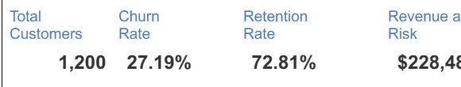
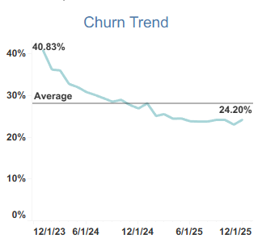
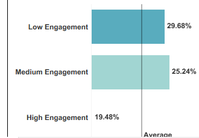
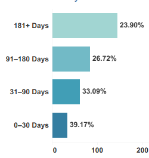
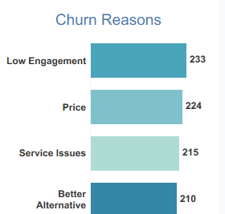

# Churn & Retention Dashboard


## Executive Summary

This project analyzes **customer churn and retention behavior** to help business, product, and customer success teams identify high-risk customers, improve engagement, reduce preventable churn, and protect recurring revenue.

Using **Tableau, SQL, Python, and Streamlit**, the analysis evaluates customer behavior across **engagement patterns, tenure, churn reasons, revenue exposure, and segment-level performance** to uncover where retention investment should be prioritized.

The dashboard enables stakeholders to move beyond descriptive reporting and into **decision-driven retention analytics** by identifying:

* Which customer segments show the highest churn exposure
* Which engagement behaviors indicate elevated churn risk
* Which tenure bands demonstrate early warning signals
* Which churn reasons deserve immediate intervention
* Which high-value customers require proactive retention action

This analysis identified **$228,489 in observed revenue exposure**, highlighted opportunities capable of supporting an estimated **5–10% churn reduction**, and surfaced retention opportunities capable of improving customer stickiness by **3–7% through targeted engagement strategies**.

**Built using Tableau, SQL, Python, and Streamlit for business intelligence, KPI reporting, and product analytics decision-making.**

---

# Dashboard Preview

## KPI Cards



---

## Churn Trend



---

## Engagement vs Churn



---

## Churn by Tenure



---

## Churn Reasons



---

## Key Dashboard Highlights

The dashboard helps stakeholders quickly evaluate:

* **Customer churn risk** across customer segments
* **Revenue exposure** linked to churned customers
* **Retention performance** across engagement levels
* **Customer behavior patterns** influencing churn
* **Tenure-based churn patterns** across the customer lifecycle
* **Top churn reasons** driving customer loss
* **Retention prioritization** for high-risk customers
---

## Business Problem

Customer churn creates **revenue leakage, reduced customer lifetime value, and weaker long-term growth performance**.

Leadership teams need visibility into:

* Which customer groups are most likely to churn
* Which behavioral signals indicate elevated churn risk
* Which engagement patterns influence retention
* Which tenure groups show early-stage churn signals
* Which churn reasons require product or customer success intervention
* Where retention investment should happen before increasing acquisition spend

Without proactive churn monitoring, organizations risk losing **high-value customers**, increasing acquisition dependency, and weakening long-term revenue performance.

---
# Decision Support Use Case

This dashboard helps business teams monitor customer retention performance, identify churn risk indicators, evaluate customer segments, and support data-driven decisions designed to improve retention, customer satisfaction, and long-term customer value.

---
## KPI Goals

| KPI             |    Value | Business Purpose                       |
| --------------- | -------: | -------------------------------------- |
| Total Customers |    1,200 | Measures customer base size            |
| Churn Rate      |   73.50% | Measures customer loss risk            |
| Retention Rate  |   26.50% | Measures customer stickiness           |
| Revenue at Risk | $228,489 | Measures financial exposure from churn |
| Avg Engagement  |    26.25 | Measures product interaction quality   |

---

## Dataset Overview

| Item            | Description                                                   |
| --------------- | ------------------------------------------------------------- |
| Dataset         | Customer churn and retention dataset                          |
| Rows            | 1,200                                                         |
| Columns         | 26                                                            |
| Date Fields     | signup_date, last_active_date, churn_date                     |
| Core Dimensions | segment, plan_type, region, device, acquisition_channel       |
| Core Metrics    | tenure_days, engagement_score, revenue, lifetime_value, churn |

The dataset was used to evaluate **customer behavior, retention performance, churn drivers, and revenue exposure risk**.

---

## EDA + Cleaning + Feature Engineering

The project includes a structured **15-step Exploratory Data Analysis (EDA) and feature engineering process**:

```text
notebooks/eda_cleaning_feature_engineering.ipynb
```

### EDA Workflow

1. Load Data
2. Dataset Overview
3. Missing Values Analysis
4. Duplicate Validation
5. Datatype Cleaning
6. Column Name Standardization
7. Text Cleaning
8. Outlier Detection
9. Range Validation
10. KPI Validation
11. Feature Engineering
12. Business Logic Validation
13. Summary Statistics
14. Final Clean Dataset Export
15. Insight Summary

### Feature Engineering

The following business-focused features were engineered:

* `churn_flag`
* `retained_flag`
* `engagement_band`
* `tenure_band`
* `revenue_at_risk`
* `ltv_at_risk`
* `risk_score`
* `risk_category`

These engineered metrics improve **retention prioritization, churn monitoring, and customer risk segmentation**.

---

## Representative SQL Queries

### 1. KPI Summary

```sql
SELECT
    COUNT(DISTINCT customer_id) AS total_customers,
    AVG(churn_flag) AS churn_rate,
    1 - AVG(churn_flag) AS retention_rate,
    SUM(revenue_at_risk) AS revenue_at_risk,
    AVG(engagement_score) AS avg_engagement
FROM churn_retention_clean;
```

### 2. Segment Churn Rate

```sql
SELECT
    segment,
    COUNT(DISTINCT customer_id) AS customers,
    AVG(churn_flag) AS churn_rate,
    SUM(revenue_at_risk) AS revenue_at_risk
FROM churn_retention_clean
GROUP BY segment
ORDER BY churn_rate DESC;
```

### 3. Engagement vs Churn

```sql
SELECT
    engagement_band,
    COUNT(DISTINCT customer_id) AS customers,
    AVG(churn_flag) AS churn_rate,
    AVG(engagement_score) AS avg_engagement,
    SUM(revenue_at_risk) AS revenue_at_risk
FROM churn_retention_clean
GROUP BY engagement_band
ORDER BY churn_rate DESC;
```

### 4. Churn Reasons

```sql
SELECT
    churn_reason,
    COUNT(*) AS churned_customers,
    SUM(revenue_at_risk) AS revenue_at_risk
FROM churn_retention_clean
WHERE churn_flag = 1
GROUP BY churn_reason
ORDER BY churned_customers DESC;
```

---

## Metrics Engineering

| Metric          | Formula                                       | Business Meaning             |
| --------------- | --------------------------------------------- | ---------------------------- |
| Churn Rate      | Churned Customers / Total Customers           | Customer loss risk           |
| Retention Rate  | 1 - Churn Rate                                | Customer stickiness          |
| Revenue at Risk | Revenue × Churn Flag                          | Revenue exposed to churn     |
| Engagement Band | Low / Medium / High                           | Customer interaction quality |
| Risk Score      | Engagement + churn signal + revenue weighting | Prioritizes retention        |

---

## Analytics Workflow

```text
Business Problem
        ↓
EDA + Cleaning
        ↓
Feature Engineering
        ↓
SQL Transformations
        ↓
Metrics Engineering
        ↓
Dashboard Build (Tableau)
        ↓
Streamlit Recreation
        ↓
Business Insights
        ↓
Recommendation
        ↓
Executive Decision
```

---

## Product Insights

### Insight

Customers with **lower engagement behavior** demonstrate significantly higher churn exposure, while specific customer segments show elevated retention risk and stronger revenue vulnerability.

### Action

Customer Success and Product teams should monitor:

* engagement score
* session activity
* tenure band
* churn reason
* revenue exposure
* customer segment risk

on a recurring basis to identify customers requiring intervention.

### Recommendation

Launch **targeted retention campaigns** focused on:

* low-engagement customers
* high-value customers
* customers entering high-risk tenure bands
* customers showing declining engagement trends

before they transition into late-stage churn.

### Decision

Prioritize **retention investment before acquisition spending** by focusing resources on high-risk customer groups with meaningful revenue exposure.

---

## Decision Framework

| Decision Signal | Rule                                                | Business Action                  |
| --------------- | --------------------------------------------------- | -------------------------------- |
| High Risk       | High churn + low engagement + high revenue exposure | Immediate retention intervention |
| Medium Risk     | Moderate churn or declining engagement              | Test engagement campaigns        |
| Low Risk        | Stable retention and healthy engagement             | Maintain current experience      |
| Review          | Mixed behavioral signals                            | Conduct additional investigation |

---

## Executive Decision Summary

### Insight

Low-engagement customers and selected customer segments show the strongest churn exposure and represent elevated revenue risk.

### Action

Increase monitoring of engagement behavior, tenure patterns, and churn reasons while improving customer success intervention timing.

### Recommendation

Implement proactive retention campaigns for high-risk customers before churn risk escalates.

### Decision

Retention investment should be prioritized ahead of acquisition spend to improve long-term customer value and reduce revenue leakage.

---

## Measurable Business Impact

This dashboard enables stakeholders to:

* Identify retention opportunities capable of reducing churn by an estimated **5–10%** through earlier intervention
* Improve customer retention by an estimated **3–7%** through targeted engagement strategies
* Protect **$228,489+ in observed revenue exposure** through proactive churn monitoring
* Improve customer success prioritization using **segment, tenure, engagement, and risk scoring insights**
* Reduce inefficient acquisition spending by prioritizing retention opportunities first
* Strengthen business decision-making through KPI-driven churn analytics

---

## Streamlit App

Run locally:

```bash
pip install -r requirements.txt
streamlit run app/streamlit_app.py
```

The Streamlit application recreates the Tableau dashboard and includes:

* KPI cards
* churn monitoring
* segment analysis
* churn by tenure
* engagement vs churn analysis
* revenue exposure tracking
* churn reason breakdown
* executive decision summary

---

## Repo Architecture

```text
churn-retention-dashboard/
├── app/
│   └── streamlit_app.py
├── data/
│   ├── raw/
│   │   └── churn_retention.csv
│   └── processed/
│       └── churn_retention_clean.csv
├── dashboard/
│   └── tableau_dashboard_preview.png
├── docs/
│   ├── business_case.md
│   ├── dashboard_guide.md
│   ├── kpi_definitions.md
│   └── automation_awareness.md
├── notebooks/
│   └── eda_cleaning_feature_engineering.ipynb
├── screenshots/
│   ├── dashboard_preview.png
│   ├── kpi_cards.png
│   ├── churn_segment.png
│   └── engagement_vs_churn.png
├── sql/
│   ├── 01_kpi_summary.sql
│   ├── 02_segment_churn.sql
│   ├── 03_engagement_revenue_risk.sql
│   └── 04_churn_reasons.sql
├── .gitignore
├── README.md
└── requirements.txt
```

---

## Automation Awareness

This project can be automated using:

* Scheduled SQL refreshes for KPI reporting
* Python data cleaning pipelines for recurring refreshes
* Prefect orchestration for retention monitoring
* Streamlit Cloud deployment for stakeholder access
* Tableau Public publishing for portfolio visibility
* Snowflake or Redshift integration for scalable reporting

---

## Future Improvements

* Add churn prediction using Logistic Regression and Random Forest
* Add retention cohort heatmap
* Add customer-level churn risk scoring
* Add A/B testing readout for retention interventions
* Connect to Snowflake or Redshift for automated refreshes
* Build executive alerting system for high-risk customers
* Add experimentation reporting for retention strategies
