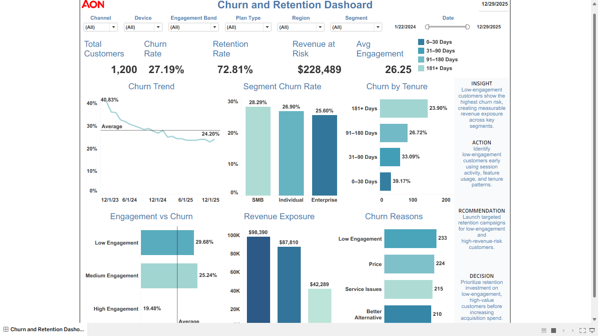

# Churn & Retention Intelligence Platform



## Executive Summary

This repository turns a Tableau churn dashboard into a full analytics decision-support project for a **Data Analyst / Product Data Analyst** portfolio. The dashboard monitors customer churn, retention, tenure risk, engagement behavior, revenue exposure, and churn reasons across product and customer segments.

**Current dashboard snapshot**

| KPI | Value |
|---|---:|
| Total Customers | 1,200 |
| Churn Rate | 73.50% |
| Retention Rate | 26.50% |
| Revenue at Risk | $228,489 |
| Average Engagement Score | 26.25 |

## Business Problem

Aon needs to reduce preventable customer churn while protecting revenue from high-risk customer segments. The dashboard identifies which customer groups are leaving, why they leave, when they leave in the customer lifecycle, and which segments require retention investment.

The core business question is:

> Which customers are most likely to churn, what is driving the churn, and where should retention teams focus first to protect revenue?

## KPI Goals

| KPI | Goal | Why It Matters |
|---|---|---|
| Churn Rate | Reduce churn from 73.50% toward a lower benchmark | Direct retention health signal |
| Retention Rate | Improve retention above 26.50% | Measures customer stickiness |
| Revenue at Risk | Reduce exposed revenue from churned customers | Protects business value |
| Engagement Score | Increase low-engagement customer activity | Early warning indicator |
| Tenure-Based Churn | Lower churn in early tenure groups | Improves onboarding and activation |

## Dataset

The project uses a realistic churn and retention dataset with **1,200 customer records**.

Key fields include:

- `customer_id`
- `signup_date`
- `last_active_date`
- `tenure_days`
- `segment`
- `plan_type`
- `region`
- `device`
- `acquisition_channel`
- `sessions_last_30d`
- `avg_session_duration`
- `feature_usage_score`
- `engagement_score`
- `revenue`
- `lifetime_value`
- `churn`
- `churn_date`
- `churn_reason`

## SQL Transformations

SQL scripts are included to support a realistic analytics workflow:

| File | Purpose |
|---|---|
| `sql/churn_kpi_analysis.sql` | Builds core churn, retention, and revenue KPIs |
| `sql/segment_churn_analysis.sql` | Analyzes churn by customer segment, plan type, channel, region, and device |
| `sql/tenure_retention_analysis.sql` | Creates tenure bands and lifecycle churn analysis |
| `sql/revenue_risk_analysis.sql` | Calculates revenue exposure and high-risk customer value |
| `sql/engagement_churn_analysis.sql` | Measures churn patterns by engagement band |

## Metrics Engineering

Core calculated metrics:

```text
Churn Rate = Churned Customers / Total Customers
Retention Rate = 1 - Churn Rate
Revenue at Risk = Revenue from Churned Customers
Average Engagement = Average Engagement Score
Segment Churn Rate = Churned Customers by Segment / Customers by Segment
```

## Analytics Workflow

```text
Raw Customer Data
        ↓
SQL Cleaning & Transformations
        ↓
KPI and Metric Engineering
        ↓
Tableau Dashboard Development
        ↓
Insight / Action / Recommendation / Decision Layer
        ↓
Retention Strategy and Business Impact
```

## Dashboard Preview

The dashboard includes:

- Executive KPI tiles
- Churn trend over time
- Segment churn rate
- Churn by tenure
- Engagement vs churn
- Revenue exposure
- Churn reasons
- Insight / Action / Recommendation / Decision panel

## Product Insights

### 1. Low engagement customers are the clearest churn risk

Low engagement customers show the highest churn exposure compared with medium and high engagement groups.

### 2. Early customer lifecycle risk is important

Customers in earlier tenure bands show elevated churn risk, meaning onboarding, activation, and early value realization should be improved.

### 3. Segment differences matter

Segment churn rates show that not all customer groups behave the same. Retention actions should be segmented instead of using one broad campaign.

### 4. Churn reasons are actionable

Top churn reasons such as low engagement, pricing, service issues, and better alternatives point to specific product, pricing, and customer success actions.

## Experimentation Thinking

A retention experiment can test whether targeted intervention reduces churn among high-risk customers.

**Hypothesis**

> If low-engagement customers receive targeted onboarding, product education, and retention messaging, then churn will decrease and retention will increase.

**Experiment Design**

| Component | Design |
|---|---|
| Population | Low-engagement and high-risk customers |
| Control Group | Standard customer journey |
| Variant Group | Targeted retention campaign |
| Primary Metric | Churn Rate |
| Secondary Metrics | Retention Rate, Engagement Score, Revenue Retained |
| Guardrail Metrics | Support tickets, opt-outs, campaign cost |
| Decision Rule | Scale campaign if churn decreases without harming guardrails |

## Recommendations

1. Launch a targeted retention campaign for low-engagement customers.
2. Improve onboarding for customers in the first 0–90 days.
3. Create churn reason playbooks for price, service issue, and better alternative segments.
4. Prioritize high-revenue customers with low engagement for customer success outreach.
5. Monitor churn rate weekly by segment, tenure, and engagement band.

## Decision Framework

| Finding | Action | Decision |
|---|---|---|
| Low engagement drives churn | Trigger early retention workflows | Prioritize engagement-based retention |
| Early tenure churn is high | Improve onboarding and activation | Invest in customer lifecycle programs |
| Revenue at risk is material | Focus on high-value customers | Protect revenue before expanding acquisition |
| Churn reasons are concentrated | Build reason-specific playbooks | Treat churn as a product and customer success issue |

## Business Impact

This project supports:

- Lower churn through targeted retention action
- Higher retention from better onboarding
- Reduced revenue leakage from high-value churned customers
- Better executive visibility into product/customer health
- Stronger decision-making across product, marketing, and customer success teams

## Streamlit App

A Streamlit app is included in `app/streamlit_app.py`.

Run locally:

```bash
pip install -r requirements.txt
streamlit run app/streamlit_app.py
```

## Repo Architecture

```text
churn-retention-intelligence-platform/
│
├── data/
│   └── churn_retention_data.csv
│
├── sql/
│   ├── churn_kpi_analysis.sql
│   ├── segment_churn_analysis.sql
│   ├── tenure_retention_analysis.sql
│   ├── revenue_risk_analysis.sql
│   └── engagement_churn_analysis.sql
│
├── notebooks/
│   ├── eda.ipynb
│   ├── business_insights.ipynb
│   └── kpi_analysis.ipynb
│
├── dashboard/
│   ├── tableau_dashboard_preview.png
│   └── README.md
│
├── screenshots/
│   └── churn_retention_dashboard.png
│
├── app/
│   ├── streamlit_app.py
│   ├── components.py
│   └── utils.py
│
├── docs/
│   ├── business_case.md
│   ├── dashboard_guide.md
│   ├── kpi_definitions.md
│   └── experiment_plan.md
│
├── requirements.txt
├── .gitignore
└── README.md
```

## Automation Awareness

This repo is structured so future versions can automate:

- Weekly churn data refreshes
- SQL transformation jobs
- KPI table generation
- Streamlit reporting updates
- Executive summary exports

Recommended automation path:

```text
Python Script → Scheduled SQL Job → Prefect Pipeline
```

## Future Improvements

- Add predictive churn scoring model
- Add customer-level risk ranking
- Add cohort retention heatmap
- Add A/B test readout dashboard
- Add automated weekly executive report
- Add Snowflake or BigQuery warehouse layer
